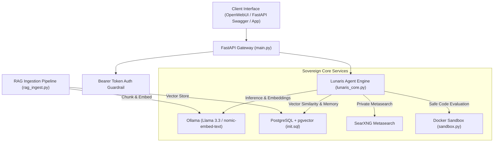

# 🌕 Lunaris AI — Sovereign Intelligence Platform

[](LICENSE)
[](https://fastapi.tiangolo.com)
[](https://www.docker.com/)
[](https://ollama.com/)
[](https://github.com/pgvector/pgvector)

**Lunaris AI** is a fully sovereign, self-hosted, private intelligence system designed with zero external cloud dependencies. It unifies local Large Language Models (LLMs), high-speed vector retrieval with `pgvector`, private internet metasearch with SearXNG, ephemeral sandboxed code execution, and an out-of-the-box conversational interface.

---

## 🏗️ Architecture



---

## 🚀 Key Features

- **🛡️ 100% Data Sovereignty**: All inference, embedding, and vector storage run locally on your hardware.
- **⚡ Local Vector RAG**: Fast Approximate Nearest Neighbor search using PostgreSQL `pgvector` and HNSW indexing.
- **🔍 Privacy-Preserving Metasearch**: Real-time web groundings via self-hosted SearXNG without user tracking.
- **🔒 Isolated Code Execution**: Air-gapped, resource-capped Docker sandboxing for agent-executed Python scripts.
- **💬 Dual Frontend Integration**: Ready to connect with OpenWebUI or custom Next.js/React frontends.
- **🔑 Production API Gateway**: Token-authenticated REST API with OpenAPI documentation.

---

## 📂 Repository Structure

```
lunaris-ai/
├── docker-compose.yml     # Complete container stack (Ollama, pgvector, SearXNG, OpenWebUI)
├── init.sql               # Database schema with pgvector & conversation memory
├── lunaris_core.py        # Central AI agent engine & autonomous context router
├── sandbox.py             # Docker-based isolated code execution sandbox
├── rag_ingest.py          # Document chunking & vector indexing pipeline
├── main.py                # FastAPI production REST gateway
├── requirements.txt       # Python dependencies
├── sample_knowledge.txt   # Example document for RAG testing
├── .env.example           # Environment configuration template
└── README.md              # Project documentation
```

---

## ⚡ Getting Started

### 1. Prerequisites
- [Docker](https://docs.docker.com/get-docker/) & Docker Compose
- [Python 3.10+](https://www.python.org/)
- *(Optional)* NVIDIA GPU with CUDA support for accelerated local inference.

### 2. Clone and Setup Environment
```bash
git clone https://github.com/BrightenGaspar/Lunaris-AI.git
cd Lunaris-AI
cp .env.example .env
```

### 3. Launch Docker Services
```bash
docker compose up -d
```

### 4. Pull Local AI Models
```bash
# Pull conversation LLM
docker exec -it lunaris_ollama ollama pull llama3.3

# Pull embedding model for RAG
docker exec -it lunaris_ollama ollama pull nomic-embed-text
```

### 5. Install Dependencies & Ingest Knowledge Base
```bash
pip install -r requirements.txt

# Ingest sample knowledge into pgvector
python rag_ingest.py
```

### 6. Start the Lunaris Gateway
```bash
uvicorn main:app --host 0.0.0.0 --port 8000 --reload
```

---

## 🌐 Service Endpoints

| Service | URL | Description |
| :--- | :--- | :--- |
| **OpenWebUI** | `http://localhost:3000` | Interactive Chat Web Interface |
| **FastAPI Swagger Docs** | `http://localhost:8000/docs` | Interactive REST API Documentation |
| **SearXNG Search** | `http://localhost:8080` | Local Private Metasearch Engine |
| **Ollama API** | `http://localhost:11434` | Raw Local LLM Inference Engine |

---

## 📡 API Reference

### Chat & Reasoning Endpoint
`POST /api/v1/chat`
```json
{
  "prompt": "What are the core capabilities of Lunaris AI?",
  "session_id": "optional-uuid-string",
  "use_web": false,
  "use_docs": true
}
```

### Sandboxed Code Execution
`POST /api/v1/sandbox/execute`
```json
{
  "code": "import math\nprint(f'Calculated root: {math.sqrt(256)}')"
}
```

### Document Ingestion
`POST /api/v1/documents/ingest`
```json
{
  "file_path": "sample_knowledge.txt",
  "title": "Lunaris Architecture"
}
```

---

## 📄 License
This project is licensed under the MIT License.
