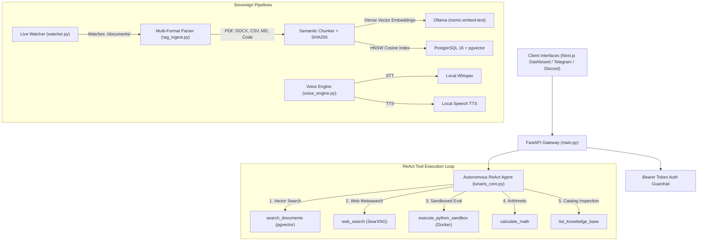

# 🌕 Lunaris AI — Sovereign Intelligence Platform

[](LICENSE)
[](https://fastapi.tiangolo.com)
[](https://nextjs.org/)
[](https://www.docker.com/)
[](https://ollama.com/)
[](https://github.com/pgvector/pgvector)

**Lunaris AI** is a sovereign, self-hosted, private intelligence platform designed with zero external cloud dependencies. It unifies local Large Language Models (LLMs), high-speed vector retrieval with `pgvector`, autonomous ReAct multi-step tool reasoning, live document folder monitoring, air-gapped voice interaction (Whisper + TTS), Telegram & Discord connectors, and a dedicated Next.js web application.

---

## 🏗️ Architecture



---

## 🚀 Complete Feature Set

- **🛡️ 100% Data Sovereignty**: All inference, embedding, voice, and vector storage run completely offline on your hardware.
- **🎨 Dedicated Next.js Web App**: Dark celestial dashboard with real-time reasoning trace accordions, document manager, sandbox terminal, and voice mic.
- **🤖 Autonomous ReAct Reasoning**: Multi-step Thought $\rightarrow$ Action $\rightarrow$ Observation reasoning loop capable of chaining multiple tools in sequence.
- **🎙️ Air-Gapped Voice (STT & TTS)**: Talk to Lunaris via microphone and receive natural synthesized speech responses offline.
- **💬 Telegram & Discord Bots**: Interact with your sovereign AI from your smartphone or team chat with voice note and document upload support.
- **📂 Multi-Format Ingestion**: Native parsing and chunking for **PDF, DOCX, CSV, JSON, Markdown, Text, and source code files**.
- **👁️ Live Folder Watcher**: Background daemon monitoring `./documents/` for instant vector indexing and automatic deletion syncing.
- **⚡ Fast Vector RAG**: PostgreSQL `pgvector` with HNSW cosine distance indexing and SHA-256 deduplication.
- **🔒 Air-Gapped Code Sandbox**: Resource-capped, non-networked Docker container execution for untrusted Python code.

---

## 📂 Repository Structure

```
lunaris-ai/
├── frontend/              # Dedicated Next.js & Tailwind CSS Web Application
│   ├── app/               # App Router & page layout
│   ├── components/        # UI components (ReasoningTrace, DocumentManager, SandboxRunner, VoiceRecorder)
│   └── package.json
├── documents/             # Drop zone for auto-ingested documents (PDF, DOCX, CSV, MD, Code)
│   ├── sample_architecture.md
│   ├── company_metrics.csv
│   └── sample_python_code.py
├── docker-compose.yml     # Container stack (Ollama, pgvector, SearXNG, OpenWebUI)
├── init.sql               # Database schema with pgvector & conversation memory
├── lunaris_core.py        # Central Autonomous ReAct reasoning engine
├── agent_tools.py         # Registry of agent tools (vector search, web search, sandbox, math)
├── sandbox.py             # Docker-based isolated code execution sandbox
├── rag_ingest.py          # Multi-format document parser & vector ingestion pipeline
├── watcher.py             # Live folder watcher daemon for real-time document indexing
├── voice_engine.py        # Air-gapped Speech-to-Text & Text-to-Speech engine
├── telegram_bot.py        # Telegram bot connector with voice and document support
├── discord_bot.py         # Discord bot connector with attachment parsing
├── main.py                # FastAPI production REST gateway
├── requirements.txt       # Python dependencies
├── .env.example           # Environment configuration template
└── README.md              # Project documentation
```

---

## ⚡ Getting Started

### 1. Prerequisites
- [Docker](https://docs.docker.com/get-docker/) & Docker Compose
- [Python 3.10+](https://www.python.org/)
- [Node.js 18+](https://nodejs.org/) (for custom Next.js frontend)

### 2. Clone and Setup Environment
```bash
git clone https://github.com/BrightenGaspar/Lunaris-AI.git
cd Lunaris-AI
cp .env.example .env
```

### 3. Launch Docker Services
```bash
docker compose up -d
```

### 4. Pull Local AI Models in Ollama
```bash
docker exec -it lunaris_ollama ollama pull llama3.3
docker exec -it lunaris_ollama ollama pull nomic-embed-text
```

### 5. Install Dependencies
```bash
# Python Backend
pip install -r requirements.txt

# Next.js Frontend
cd frontend
npm install
cd ..
```

### 6. Run Components

**Start FastAPI Gateway:**
```bash
uvicorn main:app --host 0.0.0.0 --port 8000 --reload
```

**Start Next.js Web App:**
```bash
cd frontend
npm run dev
```

**Start Live Document Watcher (Optional):**
```bash
python watcher.py
```

**Start Telegram Bot (Optional):**
```bash
python telegram_bot.py
```

---

## 🌐 Service Endpoints

| Service | URL | Description |
| :--- | :--- | :--- |
| **Lunaris Next.js Web App** | `http://localhost:3001` | Dedicated Sovereign Web Dashboard |
| **FastAPI Swagger Docs** | `http://localhost:8000/docs` | Interactive REST API Documentation |
| **OpenWebUI** | `http://localhost:3000` | Alternative Chat Web Interface |
| **SearXNG Search** | `http://localhost:8080` | Local Private Metasearch Engine |
| **Ollama API** | `http://localhost:11434` | Raw Local LLM Inference Engine |

---

## 📄 License
This project is licensed under the MIT License.
